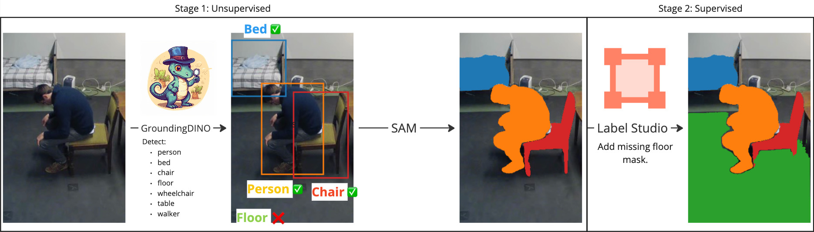

# Segment anything with SAM + Grounding DINO + Label Studio



## Table of contents

## Quickstart

1. Install dependencies

    First, install Grounding DINO. Follow their [tutorial](https://github.com/IDEA-Research/GroundingDINO).

    Then install SAM. Follow official [tutorial](https://github.com/facebookresearch/segment-anything).

    Install remaining dependencies:

    ```bash
    pip install -r requirements.txt
    ```

2. Download SAM and GroundingDINO weights

    * [SAM weights](https://github.com/facebookresearch/segment-anything#Model-checkpoints)
    * [GroundingDINO weights](https://github.com/IDEA-Research/GroundingDINO)

    Download the weights to a directory of your choice (`weights/` is a good default). If you choose a different name, remember to add it to `.gitignore`, because it is not recommended to upload large binary files to version control.

3. Specify YAML configuration

The following snippet is a minimal configuration that can be used to run segmentation. Use `config_segment_template.yaml` as a boilerplate. Detailed config information can be found in the [Config](#configuration-file) section.

```yaml
  grounding_dino:
    config_path: /path/to/GroundingDINO/groundingdino/config/GroundingDINO_SwinT_OGC.py
    checkpoint_path: /path/to/groundingdino_swint_ogc.pth
    box_threshold: 0.4
    text_threshold: 0.25
  sam:
    checkpoint_path: /path/to/sam_vit_h_4b8939.pth
    encoder_version: vit_h
  checkpoint_step: 100
  ontology:
    key:
      - "person"
    value:
      - "a human being"
  data:
    image_dir: ./raw_data
    image_extensions: [".jpg", ".png", ".jpeg"]
  annotations:
    min_image_area_percentage: 0.002
    max_image_area_percentage: 0.8
    approximation_percentage: 0.75
    root_path: ./dataset
    annotations_path: annotations/annotations.json
    labels:
      set: ["train", "val", "test"]
  ```

4. Run segmentation

  ```bash
  python main.py segment
  ```

5. Check your root dataset directory.

There should be `metadata.json` file present together with `annotations` directory containing segmentation masks in [COCO JSON](https://cocodataset.org/#format-data) files.

6. Segment more files

If you run the segmentation script on new files, the `metadata.json` file will be updated and new annotations will appear in the annotations directory. If you wish to clean annotations beforehand, use `-c` or `--clean` option.

7. Verify segmentation masks

  This script will display all masks that were segmented on the first image and their color mapping.

  ```python
  import matplotlib.pyplot as plt
  from segmentation.annotation import AnnotationMetadata

  metadata = AnnotationMetadata("./dataset", data_dir="raw_data/")
  sample_image = metadata.images[0]

  masked_image = sample_image.coco_image.draw_masks()
  plt.imshow(masked_image)
  plt.show()

  # print object:color mapping
  print(metadata.colormap())
  ```

## [Label Studio](https://labelstud.io/)

### Segment anything in Label Studio

Follow this [tutorial](https://labelstud.io/blog/get-started-using-segment-anything/) to set up machine learning backend with SAM in Label Studio. In order to integrate with the segmentation pipeline, Label Studio server must follow labeling configuration that is presented in the tutorial.

> :bulb: NOTE: name of BrushLabels was changed from "tag" to "brush".

```xml
<View>
  <Image name="image" value="$image" zoom="true"/>
  <Header value="Brush Labels"/>
  <BrushLabels name="brush" toName="image">
  	<Label value="Dog" background="#FF0000"/>
  	<Label value="Possum" background="#0d14d3"/>
  </BrushLabels>
  <Header value="Keypoint Labels"/>
  <KeyPointLabels name="tag2" toName="image" smart="true">
    <Label value="Dog" smart="true" background="#000000" showInline="true"/>
    <Label value="Possum" smart="true" background="#000000" showInline="true"/>
  </KeyPointLabels>
  <Header value="Rectangle Labels"/>
  <RectangleLabels name="tag3" toName="image" smart="true">
    <Label value="Dog" background="#000000" showInline="true"/>
    <Label value="Possum" background="#000000" showInline="true"/>
  </RectangleLabels>
</View>
```

Labels must be identical to keys specified in `ontology` section during segmentation phase.

### Exporting annotations to Label Studio

Label Studio uses a proprietary annotation format, hence a need to parse a COCO JSON to that format before annotations can be imported to the Label Studio server.

1. Export environmental variables. See `.env.template`
2. Prepare a configuration file.
3. Upload images to Label Studio project.  
  It is important to do that before running export script, otherwise file names will not match and annotations will not be imported correctly.
4. Run export script.

  ```bash
  FALL_DETECTION_CONTEXT_CONFIG_PATH=config_export.yaml \
  python main.py export-to-label-studio dataset/annotations/annotations-abc123.json
  ```

  Exported JSON will be created in `label_studio_path` with the same run id as the initial COCO JSON file, unless specified differently.

5. Import annotations to Label Studio.

### Import annotations from Label Studio

## Configuration file

`config_schema.yaml` file contains detailed information about all available parameters for configuration file.
